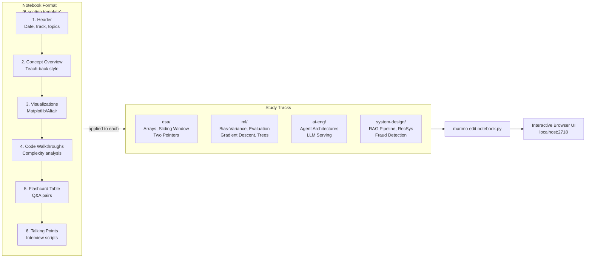

# Learning Log — Architecture

## 1. One-Liner

A structured interview-prep study log using interactive marimo notebooks — one notebook per topic, each following a six-section teaching format covering DSA, ML theory, AI engineering, and system design.

## 2. The Problem

Interview prep is notoriously unstructured: notes live in scattered docs, code examples are disconnected from explanations, and there's no consistent format for recall. This repo solves that by enforcing a repeatable notebook structure (concept → visualization → code → flashcards → talking points) that matches how technical interviews actually unfold — moving from high-level explanation to code walkthrough to behavioral Q&A.

The secondary problem: Jupyter notebooks don't diff cleanly, aren't executable as scripts, and produce messy git history. marimo notebooks are pure Python files that execute reactively without these drawbacks.

## 3. System Diagram

## 4. Tech Stack

| Layer | Technology | Why |
|-------|------------|-----|
| Runtime | Python 3.11+ | Native for DSA and ML implementations |
| Notebook engine | marimo | Pure Python files; reactive execution; git-friendly diffs |
| Visualization | matplotlib / Altair | matplotlib for statistical plots; Altair for interactive charts |
| ML examples | scikit-learn, NumPy | Standard interview-prep implementations |
| Execution | `marimo edit file.py` | Opens browser notebook; no Jupyter server required |

## 5. Architectural Patterns

### Template Method (Notebook Structure)
**Location:** Every notebook in `dsa/`, `ml/`, `ai-eng/`, `system-design/`

Each notebook follows an identical six-section structure enforced by convention: Header → Concept Overview → Visualizations → Code Walkthroughs → Flashcard Summary → Interview Talking Points. The structure is a Template Method in the pedagogical sense — the skeleton is fixed, only the content varies.

**Why right here:** Consistency is the entire value. A reviewer can skip to section 6 "Talking Points" in any notebook and immediately find scripted interview answers without reading the rest.

**Alternative considered:** Free-form notes. Rejected — free-form notes degrade over time into unstructured text with no recall path.

---

### Track Separation (Module per Domain)
**Location:** `dsa/`, `ml/`, `ai-eng/`, `system-design/`

Each interview domain is an isolated directory. No cross-imports; notebooks are standalone. This matches the mental model of technical interviews, where DSA questions are separate from ML design questions.

**Why right here:** Interview domains are assessed independently. Mixing them in one flat directory obscures what's been covered in each area.

---

## 6. Data Flow

**Scenario: Studying bias-variance tradeoff before an ML interview**

1. Run `marimo edit ml/bias-variance-regularization.py` from repo root
2. marimo launches a local server and opens the notebook in the browser
3. User reads the Concept Overview section (explain it as if teaching a junior dev)
4. User interacts with the visualization: a bias-variance decomposition plot with a slider for model complexity
5. User reads the code walkthrough: L1/L2 regularization implementations with complexity notes
6. User quizzes themselves on the Flashcard Table (Q: "What does increasing lambda in Ridge regression do to bias/variance?")
7. User reads and practices section 6 Talking Points — scripted 60-second answers for common interview questions

## 7. Key Technical Decisions & Trade-offs

| Decision | Why | Trade-off accepted | Alternative considered |
|----------|-----|--------------------|----------------------|
| marimo over Jupyter | Pure Python files; clean git diffs; reactive execution catches stale cell order bugs | Smaller ecosystem; fewer extensions | Jupyter — more extensions but `.ipynb` JSON diffs are unreadable |
| One file per topic | Atomic, self-contained review unit; easy to open one concept the night before an interview | Some duplication of imports across notebooks | Single mega-notebook — loses granularity; takes longer to load |
| Four tracks (DSA, ML, AI Eng, System Design) | Maps to the four interview rounds at most ML/AI companies | No cross-topic notebooks (e.g., DSA used inside ML systems) | Flat structure — loses interview-type mapping |
| Six-section template | Interview format matches this order: explain → visualize → code → recall → talk | Rigid; some topics don't need all six sections | Free-form — more flexible but sacrifices scannability |

## 8. What I'd Improve With More Time

- **No spaced repetition**: The flashcard tables are static Q&A. Would integrate with Anki export or a simple review scheduler that surfaces due cards.
- **No progress tracking**: No record of which notebooks have been studied or when. Would add a `progress.json` that tracks last-studied date per notebook.
- **System design notebooks are thin**: `dsa/` and `ml/` have multiple deep notebooks; `system-design/` has only stubs. Would expand with full RAG pipeline and RecSys design walkthroughs.
- **Visualizations aren't interactive everywhere**: Some ML notebooks use static matplotlib. Would convert to Altair for all interactivity (parameter sliders are the key learning tool for bias-variance).

## 9. Interview Talking Points

I built Learning Log to solve my own interview prep problem: scattered notes with no consistent recall path. Every notebook forces me to write a "teach-back" explanation, build an interactive visualization, walk through code with complexity analysis, and write scripted talking points — which maps directly to how ML interviews actually run. The use of marimo instead of Jupyter was a deliberate choice: the files are pure Python, diff cleanly in git, and reactive execution catches the cell-ordering bugs that trip people up in Jupyter. The most valuable section is always the Talking Points — having a scripted 60-second answer ready beats improvising every time.

---

**Top 3 patterns:** Template Method (six-section notebook), Track Separation (domain isolation), marimo reactive execution

**Top 3 trade-offs:** marimo vs Jupyter (git cleanliness vs ecosystem), per-topic files vs mega-notebook (granularity vs setup overhead), rigid template vs free-form (scannability vs flexibility)

**One thing to consider improving:** No spaced repetition — the flashcard tables are static, so without a scheduler, review is ad hoc rather than optimized for long-term retention.
